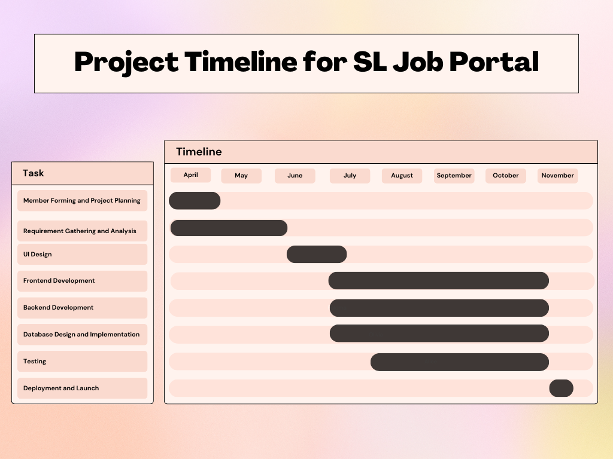
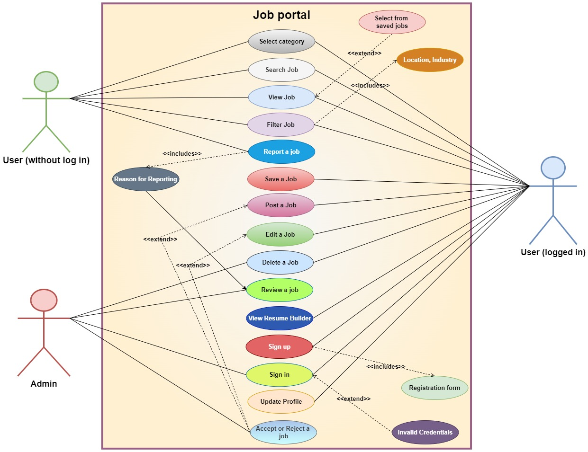

# SL-Job-Portal

Repository for Creating a centralized Job portal in Sri Lanka

This is our project timeline
We must strictly follow the time schedule

Our project usecase diagram

Introduction::
In today's world, finding the right job can feel like searching for a needle in a haystack. That's
why we are super excited to introduce our project: a brand-new job portal. We are setting out to
create something that's not just another job site, but a game-changer for both job seekers and
employers.
Our project is all about helping people navigate their career paths with confidence and
connecting employers with the talent they need.
